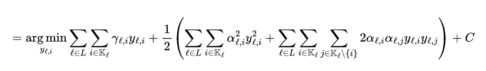

# 2025 Quantum Program - Quantum Project 2

Team name: **EntangledBitterGourd**      
Members:
- Henokh Lugo (gst-MlaI21bO5FRYdyD)
- Vinay K (gst-QcL1CBJvvholFTu)
- Rutuja Pable (gst-sOMzNWAzMWkUIOb)


In this project, we solve the bond optimization problem
using Variatonal Quantum Eigensolver algorithm based on 
the work of (Chen, 2023) with some modification. 
The problem that we are going to solve is defined as 
a constrained optimization problem with the following forms



where $y_{\ell, i}$ are binary variables that determine
whether we include a bond or not into our portfolio.
The other symbols ($\gamma_{\ell, i}$ and $\alpha_{\ell, i}$) are parameters that are defined by the characteristic
of the bonds $i$ and the sector $\ell$. $C$ is a constant.

Alongside with the above formula, there are 19 constraints
that are explained in the detail in the [Slides](#slides) section 

## Installation

1. Run conda environment requirement and installation
   ```

   ```

2. Run the notebook `./program/06-run-vqe.ipynb`


## Slides

Please take a look our slide in [here](https://docs.google.com/presentation/d/1bY7O3fusFT1GMOFGxjlAGDBic2viIeRAxoCRcGNsAhU/edit?usp=sharing)

## References

- [(Chen, 2023) - Part 1 and 2 - Portfolio optimization with variational quantum eigensolver (VQE)](https://eric08000800.medium.com/portfolio-optimization-with-variational-quantum-eigensolver-vqe-1-82fd17300b49)

